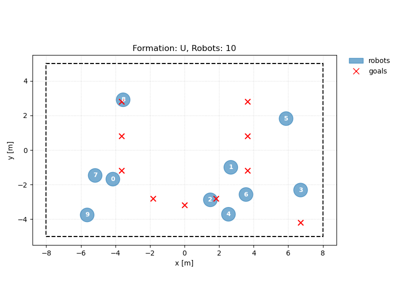
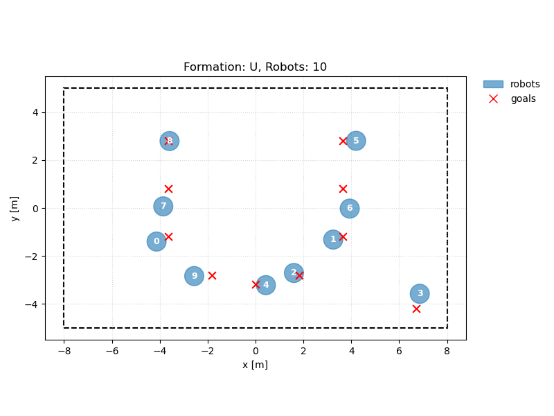

# Multi-Robot Formation Game (Work in Progress)

This repository provides a **research prototype** for multi-robot formation control and **game-theoretic trajectory optimization**.  
The project aims to model multiple robots on a 2-D plane, generate symbolic letter formations, and later formulate the task as an **open-loop dynamic game** solvable via **LQRAX** or **MCP-based** methods.

---

## ✅ Implemented Components

### 1. Environment (`environment.py`)
- Generates **letter-shaped formations**: `U`, `T`, `A`, `S`, `I`, `N`.
- Supports rectangular bounds (`A x ≤ b`) with automatic coordinate scaling.
- Adapts to arbitrary robot counts:
  - Minimal robots render the formation clearly.
  - Extra robots are placed neatly at the lower-right corner.

### 2. Robot Class (`robot.py`)
- Supports three kinematic models:
  - `bicycle`, `unicycle`, `double-integrator`.
- Each robot includes:
  - `index`, `steering_type`, `params` (`radius`, `max_velocity`, etc.),
  - `state` dict with model-dependent keys (`x`, `y`, `theta`, `v`, …).
- Provides model-specific integration via `step()`.

### 3. Visualization (`basic_utils.py`)
- Core function `visualize_scene()` renders:
  - Robots (blue filled circles with index labels),
  - Goal points (red × markers),
  - Heading / velocity arrows,
  - Scene bounds rectangle.
- Legend placed **outside the upper-right corner** for clarity.

### 4. Main Script (`main.py`)
Integrates all components:
- Creates a `U`-formation environment.
- Samples 10 non-overlapping robot initial poses.
- Visualizes both **initial** and **final** configurations for comparison.

---

## 🧠 Work in Progress

### GameSolver (`game_solver.py`)
Defines structure for a **multi-agent dynamic game solver**.

#### `construct_game(self)`
Symbolically defines the game:
\[
\min_{x^i, u^i}\;
J^i = 
\sum_t 
\Bigl(
w_g\|x_t^i - \hat g_i\|^2 
+ w_c\!\!\sum_{j\neq i}\psi(\|x_t^i-x_t^j\|)
+ w_u\|u_t^i\|^2
\Bigr),
\quad 
x_{t+1}^i = f_i(x_t^i,u_t^i)
\]
where  
- \(\hat g_i = P g_i\) is the **assigned target** for robot *i* (currently fixed);  
- \(f_i\) is the corresponding unicycle/bicycle/double-integrator dynamics.

#### `solve_game(self)`
Numerically computes the **open-loop Nash equilibrium** via an iLQR/LQRAX-style loop:
1. Linearize each robot’s dynamics \((A_i, B_i)\);
2. Compute loss gradients via JAX automatic differentiation;
3. Solve per-agent LQ subproblems for descent directions;
4. Update controls and rollout new trajectories.

The solver currently supports **fixed \(P\)** and successfully finds equilibrium trajectories under a known assignment.

---

## ⚙️ Current Progress (Nov 2025)

- ✅ **GameSolver updated:** now capable of solving the game with a *fixed assignment matrix* \(P\).  
- ✅ **Stable runtime losses:** safe norm and stable softplus functions eliminate NaNs.  
- ✅ **Visualization:** shows both initial and post-equilibrium formations for comparison.  
- ⚠️ **Computation is relatively slow:** current runs are executed on CPU.

---

## 🔍 Future Work

1. **Joint Optimization of \(P\)**  
   - At present, the assignment matrix \(P\) is fixed before solving the game.  
   - Next step: embed \(P\) into a higher-level optimization (bilevel or alternating structure) to achieve **joint goal assignment + trajectory optimization**.

2. **Performance and Acceleration**  
   - The iLQGames-style iteration runs entirely on CPU; per-iteration rollouts and gradient evaluations are slow.  
   - We plan to explore **GPU acceleration (via JAX JIT and vectorization)** to evaluate potential speed-ups.

---

## ⚠️ Current Results & Known Issues

- The solver converges for simple formations but may require careful tuning of weights and step size.  
- Collision-avoidance weights and temperature in `psi_dist` affect numerical stability.  
- The current implementation uses list-based rollouts (not fully vectorized), leaving performance improvements for later iterations.

---

## 🧩 Next Steps

1. Integrate the goal-assignment optimization into `construct_game()` to jointly optimize \(P\).  
2. JIT-compile rollout and gradient computation; benchmark CPU vs GPU runtime.  
3. Extend distance modeling with ESDF for arbitrary robot shapes.  
4. Add convergence visualization and per-agent cost breakdown plots.

---

## 📊 Visualization Example

Below are example visualizations of the **initial** and **post-game (equilibrium)** configurations for the `U`-formation case.

| Initial Condition | Terminal Condition (After Game Solving) |
|--------------------|-----------------------------------------|
|  |  |

---

## 👥 Contributors
| Name | Contribution |
|------|---------------|
| **Zehao Wang** | Environment & robot generation, solver implementation, visualization |
| **Tianyu Qiu** | Framework design |
| **Shotaro Nako** | Code development |

---

## 📅 Project Status
- ✅ Core framework & visualization — **Completed**  
- ✅ Fixed-P game solver — **Working**  
- 🚧 Joint \(P\) optimization — **Next milestone**  
- 🔜 GPU acceleration & performance profiling — **Upcoming**
